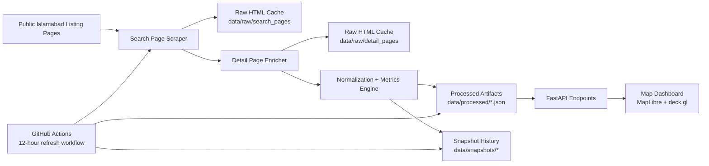

# Islamabad Land Price HeatMap

[](https://github.com/rTalhaa/Islamabad-Land-Price-HeatMap/actions/workflows/refresh-market-data.yml)
[](https://rtalhaa.github.io/Islamabad-Land-Price-HeatMap/)
[](https://www.python.org/)
[](https://fastapi.tiangolo.com/)
[](https://maplibre.org/)
[](https://deck.gl/)
[](https://github.com/rTalhaa/Islamabad-Land-Price-HeatMap)

An Islamabad-only property intelligence project that turns public listing data into a map-first market research experience.

Live atlas: [https://rtalhaa.github.io/Islamabad-Land-Price-HeatMap/](https://rtalhaa.github.io/Islamabad-Land-Price-HeatMap/)

The repository combines:

- an automated scraping pipeline for Islamabad houses, apartments, and residential plots
- a normalization layer that converts raw listing pages into clean JSON and GeoJSON artifacts
- a FastAPI backend that serves processed outputs
- a static export path for GitHub Pages deployment
- a map dashboard built with MapLibre GL JS and deck.gl
- recurring refresh automation through GitHub Actions

## Why This Exists

The goal of the project is to make Islamabad land and property pricing easier to understand spatially.

Instead of reading through isolated listings one by one, the dashboard helps answer questions like:

- which neighborhoods are clustering at the highest price-per-square-foot levels
- how inventory is split across houses, apartments, and plots
- how refreshed market snapshots move over time
- where density differs from raw ticket size

## Architecture



## How It Works

Each pipeline run follows the same flow:

1. scrape Islamabad search result pages for the configured seeds
2. deduplicate listing cards collected across categories
3. fetch each listing detail page for coordinates and richer metadata
4. normalize price, area, freshness, and category fields
5. export processed artifacts for the API and frontend
6. append a historical snapshot so later runs can show market drift

## Tracked Islamabad Inventory

The current pipeline tracks:

- Houses
- Flats and Apartments
- Residential Plots

## Repository Layout

```text
.
|-- .github/workflows/
|   |-- deploy-pages.yml            # GitHub Pages deployment
|   `-- refresh-market-data.yml     # Scheduled dataset refresh
|-- data/
|   |-- processed/                  # API-ready JSON and GeoJSON
|   |-- raw/                        # Cached listing HTML
|   `-- snapshots/                  # Historical exports per run
|-- islamabad_market/
|   |-- config.py                   # Seed definitions and paths
|   |-- scraper.py                  # Search/detail page collection
|   |-- parsers.py                  # Price, area, and payload parsing
|   |-- pipeline.py                 # End-to-end dataset build
|   `-- utils.py                    # Shared helpers
|-- scripts/
|   |-- bootstrap.ps1               # Local setup + first run
|   |-- build_static_site.py        # Static export for GitHub Pages
|   |-- run_pipeline.ps1            # Repeatable refresh command
|   `-- start_server.ps1            # Local API/dashboard server
|-- static/
|   |-- index.html                  # Dashboard shell
|   |-- styles.css                  # Dashboard styling
|   `-- app.js                      # Map and UI behavior
`-- app.py                          # FastAPI application
```

## Data Products

The main outputs generated by the pipeline are:

- `data/processed/listings.json`
- `data/processed/map_points.geojson`
- `data/processed/neighborhoods.json`
- `data/processed/summary.json`
- `data/processed/history.json`
- `data/processed/report.json`

These files are what the FastAPI layer serves to the dashboard.

## Quick Start

Bootstrap the environment and build an initial dataset:

```powershell
.\scripts\bootstrap.ps1 -PagesPerSeed 2
```

Start the local app:

```powershell
.\scripts\start_server.ps1
```

Then open:

```text
http://127.0.0.1:8000
```

Build the static deployment bundle:

```powershell
.\.venv\Scripts\python scripts\build_static_site.py
```

## Common Commands

Run a normal refresh:

```powershell
.\scripts\run_pipeline.ps1 -PagesPerSeed 3
```

Run a smaller local verification sample:

```powershell
.\.venv\Scripts\python -m islamabad_market.pipeline --pages-per-seed 1 --listing-limit 18
```

Force cache refresh:

```powershell
.\scripts\run_pipeline.ps1 -PagesPerSeed 3 -RefreshCache
```

## Automation

Local automation:

- `scripts\run_pipeline.ps1` for repeatable refreshes
- `scripts\start_server.ps1` for serving the API and dashboard

Repository automation:

- `.github/workflows/deploy-pages.yml`
- `.github/workflows/refresh-market-data.yml`

The refresh workflow updates `data/processed` every 12 hours. The Pages workflow builds a static atlas bundle from the current repository state and publishes it as a public site.

## Deployment

The project now supports two serving modes:

- FastAPI for local development and API-first verification
- GitHub Pages for a free static public deployment built from the latest processed artifacts

The frontend automatically detects whether it is running from the FastAPI app or a static Pages snapshot and loads data from the correct source.

## Visualization Stack

The dashboard uses:

- FastAPI for API delivery
- MapLibre GL JS for the basemap and map container
- deck.gl for heatmaps, bins, and interactive overlays
- CARTO basemap styles for a clean geographic backdrop

## Notes

- Raw HTML caches are stored in `data/raw` so repeat runs stay fast.
- The project is intentionally Islamabad-only for this phase.
- For broader production usage, source site terms, acceptable-use policy, and crawl limits should be reviewed before increasing scrape depth.
