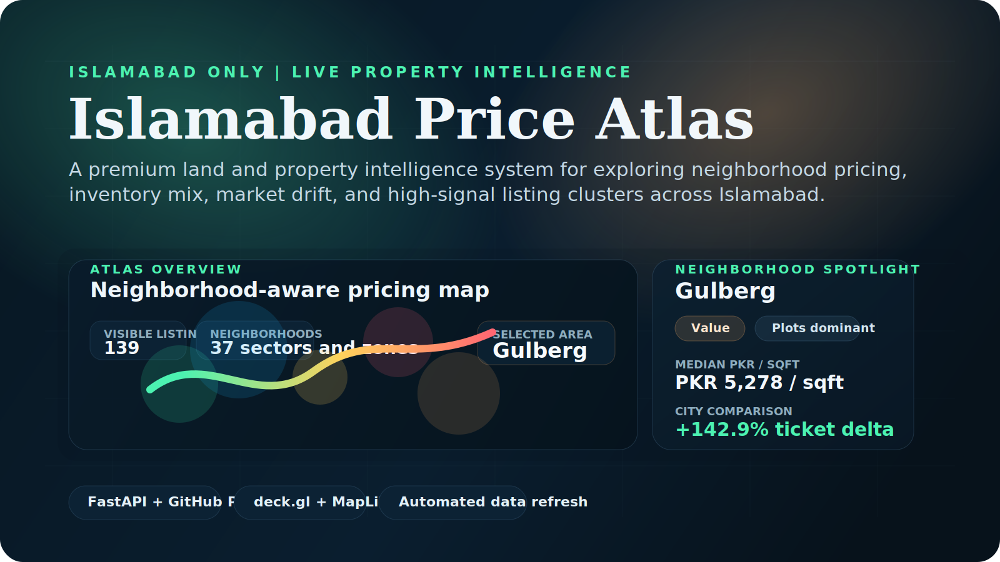
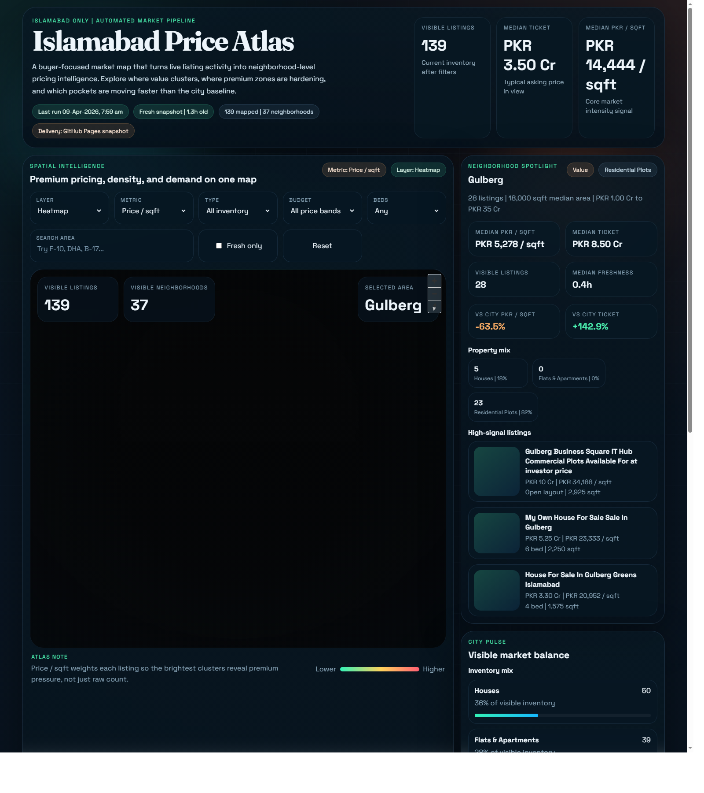
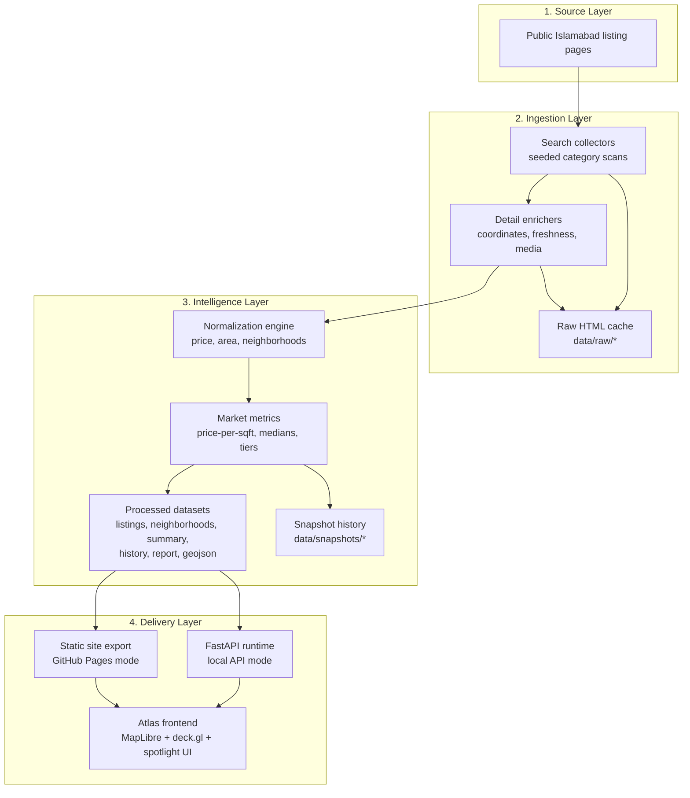
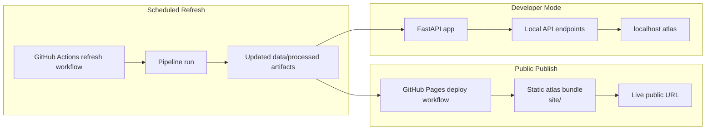

# Islamabad Price Atlas



[](https://rtalhaa.github.io/Islamabad-Land-Price-HeatMap/)
[](https://github.com/rTalhaa/Islamabad-Land-Price-HeatMap/actions/workflows/deploy-pages.yml)
[](https://github.com/rTalhaa/Islamabad-Land-Price-HeatMap/actions/workflows/refresh-market-data.yml)
[](https://www.python.org/)
[](https://rtalhaa.github.io/Islamabad-Land-Price-HeatMap/)
[](https://github.com/rTalhaa/Islamabad-Land-Price-HeatMap)

Islamabad Price Atlas is a premium Islamabad-only property intelligence experience built to turn live listing activity into something decision-ready. Instead of browsing isolated listings one by one, users can read the city spatially through neighborhood pricing, inventory mix, refresh history, and map-first market signals.

Live atlas: [https://rtalhaa.github.io/Islamabad-Land-Price-HeatMap/](https://rtalhaa.github.io/Islamabad-Land-Price-HeatMap/)

## At A Glance

The repository combines:

- an automated scraping pipeline for Islamabad houses, apartments, and residential plots
- a normalization layer that converts raw listing pages into clean JSON and GeoJSON artifacts
- a FastAPI backend that serves processed outputs
- a static export path for GitHub Pages deployment
- a map dashboard built with MapLibre GL JS and deck.gl
- recurring refresh automation through GitHub Actions

## Why It Stands Out

This is not just a listing scraper or a basic heatmap. The atlas is designed to answer higher-value market questions:

- which Islamabad pockets are actually pricing above the city baseline
- where plot-heavy and house-heavy inventory is clustering
- how neighborhood-level pricing shifts across refresh cycles
- which areas deserve attention first when scanning the map

## Product Highlights

| Capability | What it delivers |
| --- | --- |
| Neighborhood Spotlight | Locks onto a selected area and turns raw listing activity into medians, deltas, tiering, and sample listings |
| Market Intelligence Pipeline | Produces reusable processed datasets instead of one-off scrape output |
| Dual Delivery Mode | Runs locally through FastAPI and publicly through GitHub Pages from the same data layer |
| Continuous Refresh | Uses scheduled GitHub Actions to keep the atlas current without manual export steps |

## Dashboard Preview



The live interface combines a premium dark-shell map stage with a persistent neighborhood spotlight, market-balance side rail, and historical drift view so the experience feels closer to a product than a prototype.

## Use Cases

- `Buy-side scanning` for identifying which sectors and housing clusters look expensive or underpriced relative to the city median
- `Investor research` for spotting plot-heavy or house-heavy pockets and watching how pricing shifts across refresh cycles
- `Neighborhood comparison` for checking median ticket size, PKR per square foot, freshness, and listing density at a glance
- `Product and data storytelling` for turning raw public listing activity into a clearer visual narrative for demos, portfolios, or market monitoring

## Why This Exists

The goal of the project is to make Islamabad land and property pricing easier to understand spatially and much faster to interpret.

Instead of reading through isolated listings one by one, the atlas helps answer questions like:

- which neighborhoods are clustering at the highest price-per-square-foot levels
- how inventory is split across houses, apartments, and plots
- how refreshed market snapshots move over time
- where density differs from raw ticket size

## Product Direction

The atlas is intentionally opinionated:

- `Islamabad only` so the data model stays focused instead of generic
- `neighborhood-first` so the UI helps decisions, not just browsing
- `processed-data driven` so local development and public deployment stay aligned
- `premium visual language` so the experience feels closer to a product than a dashboard demo

## Architecture

The product is easiest to understand as three connected layers:

- `Data acquisition` collects and caches Islamabad listing pages.
- `Market intelligence` normalizes listings into reusable atlas datasets.
- `Delivery` serves the same processed data through local FastAPI or the public GitHub Pages snapshot.

### System Architecture



### Delivery Architecture



### What The Diagrams Mean

- The scraper and parser layer is not the product by itself; it exists to continuously build reusable market datasets.
- The core asset is `data/processed`, because both the local app and the deployed public atlas are driven from that same intelligence layer.
- The frontend is delivery-mode aware, which means the same experience can run from live FastAPI routes locally or from static JSON on GitHub Pages.

## How It Works

Each pipeline run follows the same flow:

1. scrape Islamabad search result pages for the configured seeds
2. deduplicate listing cards collected across categories
3. fetch each listing detail page for coordinates and richer metadata
4. normalize price, area, freshness, and category fields
5. export processed artifacts for the API and frontend
6. append a historical snapshot so later runs can show market drift

## Tracked Islamabad Inventory

The current pipeline tracks:

- Houses
- Flats and Apartments
- Residential Plots

## Repository Layout

```text
.
|-- .github/workflows/
|   |-- deploy-pages.yml            # GitHub Pages deployment
|   `-- refresh-market-data.yml     # Scheduled dataset refresh
|-- data/
|   |-- processed/                  # API-ready JSON and GeoJSON
|   |-- raw/                        # Cached listing HTML
|   `-- snapshots/                  # Historical exports per run
|-- islamabad_market/
|   |-- config.py                   # Seed definitions and paths
|   |-- scraper.py                  # Search/detail page collection
|   |-- parsers.py                  # Price, area, and payload parsing
|   |-- pipeline.py                 # End-to-end dataset build
|   `-- utils.py                    # Shared helpers
|-- scripts/
|   |-- bootstrap.ps1               # Local setup + first run
|   |-- build_static_site.py        # Static export for GitHub Pages
|   |-- run_pipeline.ps1            # Repeatable refresh command
|   `-- start_server.ps1            # Local API/dashboard server
|-- static/
|   |-- index.html                  # Dashboard shell
|   |-- styles.css                  # Dashboard styling
|   `-- app.js                      # Map and UI behavior
`-- app.py                          # FastAPI application
```

## Data Products

The main outputs generated by the pipeline are:

- `data/processed/listings.json`
- `data/processed/map_points.geojson`
- `data/processed/neighborhoods.json`
- `data/processed/summary.json`
- `data/processed/history.json`
- `data/processed/report.json`

These processed files power both the local FastAPI mode and the live GitHub Pages deployment.

## Roadmap

- tighten scraper resilience with health reporting and failure visibility
- improve map rendering and tooltip polish in real-browser sessions
- introduce richer storytelling for premium and value corridors across the city
- expand the atlas with stronger market narratives and richer screenshots

## Quick Start

Bootstrap the environment and build an initial dataset:

```powershell
.\scripts\bootstrap.ps1 -PagesPerSeed 2
```

Start the local app:

```powershell
.\scripts\start_server.ps1
```

Then open:

```text
http://127.0.0.1:8000
```

Build the static deployment bundle:

```powershell
.\.venv\Scripts\python scripts\build_static_site.py
```

## Common Commands

Run a normal refresh:

```powershell
.\scripts\run_pipeline.ps1 -PagesPerSeed 3
```

Run a smaller local verification sample:

```powershell
.\.venv\Scripts\python -m islamabad_market.pipeline --pages-per-seed 1 --listing-limit 18
```

Force cache refresh:

```powershell
.\scripts\run_pipeline.ps1 -PagesPerSeed 3 -RefreshCache
```

## Automation

Local automation:

- `scripts\run_pipeline.ps1` for repeatable refreshes
- `scripts\start_server.ps1` for serving the API and dashboard

Repository automation:

- `.github/workflows/deploy-pages.yml`
- `.github/workflows/refresh-market-data.yml`

The refresh workflow updates `data/processed` every 12 hours. The Pages workflow then builds a static atlas bundle from the current repository state and publishes it as a public site.

## Deployment Modes

The project now supports two serving modes:

- FastAPI for local development and API-first verification
- GitHub Pages for a free static public deployment built from the latest processed artifacts

The frontend automatically detects whether it is running from the FastAPI app or a static Pages snapshot and loads data from the correct source.

## Visualization Stack

The dashboard uses:

- FastAPI for API delivery
- MapLibre GL JS for the basemap and map container
- deck.gl for heatmaps, bins, and interactive overlays
- CARTO basemap styles for a clean geographic backdrop

## Notes

- Raw HTML caches are stored in `data/raw` so repeat runs stay fast.
- The project is intentionally Islamabad-only for this phase.
- The public site is deployed from the repository through GitHub Pages and the `deploy-pages.yml` workflow.
- For broader production usage, source site terms, acceptable-use policy, and crawl limits should be reviewed before increasing scrape depth.
